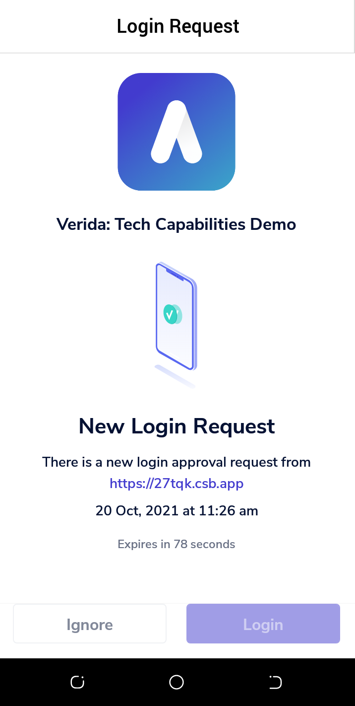
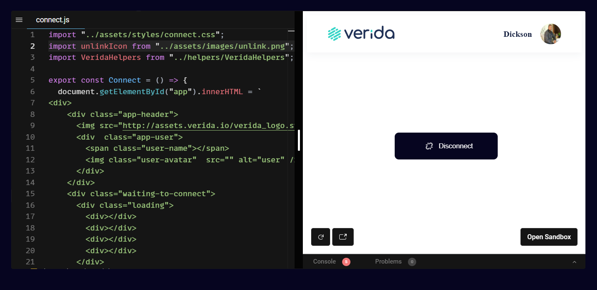

# Connect to the Verida Vault

In this tutorial, you will use the tech capabilities demo to connect to the Verida Vault. Follow this tutorial to:

> * Get the demo project running on your local dev box
> * Establish a connection to Verida Vault
> * Test and reset the connection

## Prerequisites

To initialize a connection with the Verida Vault, you should 

* Get Vue js running on a local web server
* Install a code editor such as Visual studio code

## How the demo works

This tutorial is based on a scenarion where you use the tech capabilities demo to connect to the Verida Vault. It provides some live code editing feature that you can optionally use to test and run your code. Upon runnning the code, it creates the standard Verida connect modal dialog that prompts you to connect to Verida Vault. 

You will use the Verida Vault on your mobile device to log in and your public profile will be displayed, which indicates successful connection to the Verida Vault. 

## Get the demo running on your local dev box


## Connect to Verida Vault





## Test and reset the connection





## Code example

Below is a sample code on initializing a connection to the Verida Vault.

---

```js
import { Network } from "@verida/client-ts";
import { VaultAccount } from "@verida/account-web-vault";

const EventEmitter = require("events");

const LOGO_URL = "http://assets.verida.io/verida_logo.svg";

const CERAMIC_URL = "https://ceramic-clay.3boxlabs.com";

const CONTEXT_NAME = "Verida: Tech Capabilities Demo";
const VERIDA_TESTNET_DEFAULT_SERVER = "https://db.testnet.verida.io:5002/";

const TEST_DATASTORE_SCHEMA = "https://27tqk.csb.app/schemas/store-data.json";

class VeridaHelpers extends EventEmitter {
  context = {};
  account = null;
  did = "";
  error = {};
  profile = {};
  database = {};
  dataStore = {};

  /**
   * Public method for initializing this app
   */
  async initApp() {
    if (!this.context) {
      await this.connect();
    }
  }

  appInitialized() {
    return this.context !== null;
  }

  async connect() {
    this.account = new VaultAccount({
      defaultDatabaseServer: {
        type: "VeridaDatabase",
        endpointUri: VERIDA_TESTNET_DEFAULT_SERVER,
      },
      defaultMessageServer: {
        type: "VeridaMessage",
        endpointUri: VERIDA_TESTNET_DEFAULT_SERVER,
      },
      vaultConfig: {
        logoUrl: LOGO_URL,
      },
    });

    this.context = await Network.connect({
      client: {
        ceramicUrl: CERAMIC_URL,
      },
      account: this.account,
      context: {
        name: CONTEXT_NAME,
      },
    });

    this.did = await this.account.did();
    await this.initProfile();

    this.emit("initialized");

    this.database = await this.context.openDatabase("test_db");
    this.dataStore = await this.context.openDatastore(TEST_DATASTORE_SCHEMA);
  }

  async initProfile() {
    try {
      const client = await this.context.getClient();
      const profile = await client.openPublicProfile(this.did, "Verida: Vault");
      const cb = async () => {
        const data = await profile.getMany();
        this.profile = data.reduce((result, item) => {
          result[item.key] = item.value;
          return result;
        }, {});
        this.emit("profileChanged", this.profile);
      };
      profile.listen(cb);
      await cb();
    } catch (error) {
      console.log("User", { error });
    }
  }

  async logout() {
    await this.account.disconnect();
    this.context = null;
    this.account = null;
    this.did = "";
    this.database = "";
    this.error = {};
    this.profile = {};
  }
}

const veridaHelpers = new VeridaHelpers();

export default veridaHelpers;
```


## Next steps

* Move on to the next scneario in this tutorial series, [send message](./send-message.md)