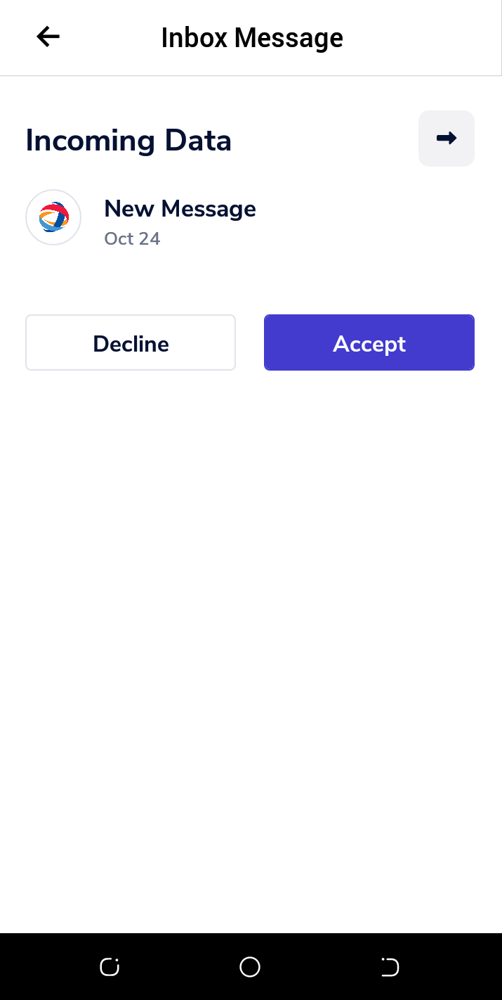

In this tutorial, you will use the tech capabilities demo and Verida Vault to send a message to a DID. Follow this tutorial to:
&nbsp;

> - Learn how the send message demo works
> - Create and send a message
> - Accept and read a message on Verida Vault
>   &nbsp;

## Prerequisites

&nbsp;
In order to complete this tutorial, you must first:
&nbsp;

- Create a connection to the Verida Vault as described in the [connect section](./connect.md) of this tutorial series
- Get the DID of the recipient intended for the message
  &nbsp;

## How the send message demo works

&nbsp;
The send message tutorial walks you through the process of securely sending messages and data to other parties using the Verida Vault. All interactions occur on the Verida Vault, so messages are encrypted to ensure privacy and security. When sending a message, you will need a DID for the intended recipient. In this demo scenario, we will use the DID on your Verida Vault mobile app for demonstration. However, you can change the DID to match the intended recipients as desired.
&nbsp;
Once a message is sent successfully, the receipient receives a mobile notification asking them to accept or reject the message. Upon accepting the message, the recipient can then read it's ontents.
&nbsp;

## Creating and sending a message

&nbsp;

To transfer a message, select the "send message" button on the right-side panel. If your screen shows "connect" instead of "send message", start by [connecting to Verida Vault](./connect). In this scenario, the Verida connect modal won't popup because we are already logged into Verida Vault and our session stored.


Upon selecting the send message button, the demo navigates to a screen where you can enter the recipient's DID and an empty text box where you can type your message. By default, the DID field contains the DID on your mobile application, but you can change it to another receiver DID.


When you're done typing the message, click send. You will receive a confirmation that your message has been successfully sent to the recipient.

&nbsp;

## Reading the message

On your mobile device, you should see a Verida Vault notification for the message received from the demo app. Tap on the Verida Vault new message notification to accept or reject the incoming data. You might need to authenticate with biometrics or PIN before accepting or viewing the message.



Upon accepting the message, you can view its contents and take action. All messages will also include a timestamp indicating the send date and time.
&nbsp;

## Code example

&nbsp;
Below is an example code sample showing how to send a message to a specific DID using the tech capabilities demo and Verida Vault.
&nbsp;

```tsx
import { Network } from "@verida/client-ts";
import { VaultAccount } from "@verida/account-web-vault";

const EventEmitter = require("events");

const LOGO_URL = "http://assets.verida.io/verida_logo.svg";

const CERAMIC_URL = "https://ceramic-clay.3boxlabs.com";

const CONTEXT_NAME = "Verida: Tech Capabilities Demo";
const VERIDA_TESTNET_DEFAULT_SERVER = "https://db.testnet.verida.io:5002/";

const TEST_DATASTORE_SCHEMA = "https://27tqk.csb.app/schemas/store-data.json";

class VeridaHelpers extends EventEmitter {
 .....

  async sendMessage(message, title) {
    const type = "inbox/type/dataSend";
    try {
      const data = {
        data: [message],
      };

      const config = {
        recipientContextName: "Verida: Vault",
      };
      const messaging = await this.context.getMessaging();
      const response = await messaging.send(
        this.did,
        type,
        data,
        title,
        config
      );
      return response;
    } catch (error) {
      console.log("messenger error", { error });
    }
  }

  ....
}

const veridaHelpers = new VeridaHelpers();

export default veridaHelpers;
```

&nbsp;

## Next steps:

&nbsp;

- Move on to the next scenario in this tutorial series, [store schemaless data](./store-schemaless-data)
